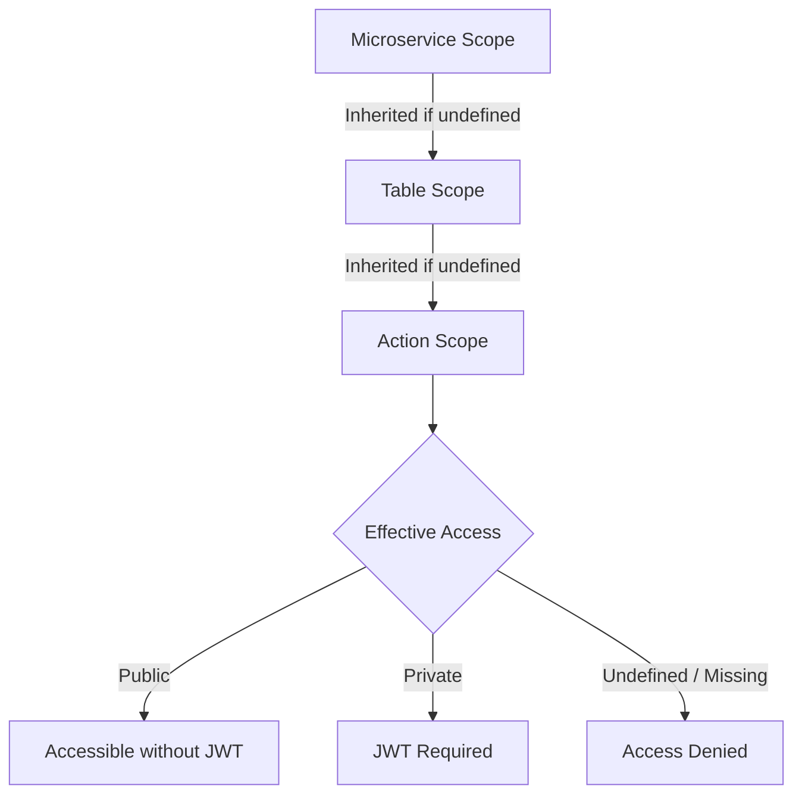

# 🧭 Gateway Routing Configuration

This document explains the **typed routing configuration** introduced in the Gateway that defines:

-   microservice routes and their message queues,
-   allowed tables and actions,
-   and their respective **access scopes** (`Public` or `Private`).

---

## 📦 Overview

The configuration is defined in `appsettings.json` under the `GatewayRouting` section.

```json
"GatewayRouting": {
  "Microservices": [
    {
      "Id": "mainsite",
      "Queue": "mainsite_queue",
      "Scope": "Private",
      "Tables": [
        {
          "Name": "Countries",
          "Scope": "Public",
          "Actions": [
            { "Name": "List", "Scope": "Public" }
          ]
        },
        {
          "Name": "GameTypes",
          "Scope": "Private",
          "Actions": [
            { "Name": "List", "Scope": "Public" }
          ]
        }
      ]
    },
    {
      "Id": "worldofwarcraft",
      "Queue": "worldofwarcraft_queue",
      "Scope": "Private",
      "Tables": [
        {
          "Name": "Classes",
          "Scope": "Public",
          "Actions": [
            { "Name": "List" }
          ]
        }
      ]
    }
  ]
}
```

---

## ⚙️ Hierarchical structure

| Level                   | Class               | Description                                                                                                          |
| ----------------------- | ------------------- | -------------------------------------------------------------------------------------------------------------------- |
| 🧱 **Microservice**     | `MicroserviceRoute` | Identifies the microservice (`Id`) and its RabbitMQ queue. Defines a **default scope** for all its resources.        |
| 📄 **Table / Resource** | `TableRoute`        | Represents a logical resource (e.g. `Users`, `GameTypes`). Can override the microservice scope.                      |
| ⚡ **Action**           | `ActionRoute`       | Represents a specific operation (`List`, `Create`, `Update`, etc.). Can override both table and microservice scopes. |

---

## 🔁 Scope Inheritance Diagram



---

## 🔒 Access scope rules

Each configuration node may define an **access scope**:

-   `Public` → accessible without authentication
-   `Private` → requires a valid JWT (Keycloak / OIDC)

Scopes are **inherited hierarchically**:

> **Action → Table → Microservice**

Meaning:

1. If an **action** defines a scope → it takes priority.
2. If not, the **table’s** scope applies.
3. If the table has no explicit scope, the **microservice’s** scope is used.
4. If a table or microservice is **not defined at all**, access is denied.

---

### 🔍 Examples

| Configuration                             | Example Route                  | Evaluated Action | Effective Scope        |
| ----------------------------------------- | ------------------------------ | ---------------- | ---------------------- |
| `GameTypes` (Private) → `List` (Public)   | `/api/mainsite/GameTypes`      | `List`           | 🟢 Public              |
| `GameTypes` (Private) → no action defined | `/api/mainsite/GameTypes/123`  | `Get`            | 🔒 Private             |
| `Countries` (Public) → no action override | `/api/mainsite/Countries/123`  | `Get`            | 🟢 Public              |
| `Classes` (Public) → `List` (inherits)    | `/api/worldofwarcraft/Classes` | `List`           | 🟢 Public              |
| Undefined table                           | `/api/mainsite/Users`          | Any              | ❌ Denied (BadRequest) |

---

## 🧩 Implicit CRUD actions

| HTTP Verb                       | Default Action | Example Path                |
| ------------------------------- | -------------- | --------------------------- |
| `GET /api/{ms}/{table}`         | `List`         | `/api/mainsite/GameTypes`   |
| `GET /api/{ms}/{table}/{id}`    | `Get`          | `/api/mainsite/GameTypes/1` |
| `POST /api/{ms}/{table}`        | `Create`       | `/api/mainsite/GameTypes`   |
| `PUT /api/{ms}/{table}/{id}`    | `Update`       | `/api/mainsite/GameTypes/1` |
| `DELETE /api/{ms}/{table}/{id}` | `Delete`       | `/api/mainsite/GameTypes/1` |

These are mapped internally using  
`RequireAuthorizationIfNotPublic("List")`, `"Create"`, `"Get"`, etc.,  
so that the **correct action scope** is applied even when not present in the URL.

---

## 🔐 Authorization resolution

All route authorization is delegated to `GatewayRouter`, which enforces the following logic:

```csharp
if (action.HasExplicitScope)
    return action.Scope == AccessScope.Public;

if (table.HasExplicitScope)
    return table.Scope == AccessScope.Public;

return microservice.Scope == AccessScope.Public;
```

If none are defined or the resource is missing, access is denied by default.

---

## 🧰 Validation

Startup validation ensures the configuration is consistent:

-   No duplicate microservice IDs
-   Each microservice defines a queue
-   No duplicate table names within a microservice
-   No duplicate action names within a table
-   No empty or null identifiers

Invalid configurations will block startup with a clear error message.

Example:

```
Invalid GatewayRouting configuration:
 - Duplicate table 'Users' found in microservice 'MainSite'.
 - Microservice 'WorldOfWarcraft' has no defined queue.
```

Validation is automatically triggered on startup via:

```csharp
builder.Services
    .AddSingleton<IValidateOptions<GatewayRoutingSettings>, GatewayRoutingValidator>();

builder.Services
    .AddOptions<GatewayRoutingSettings>()
    .Bind(builder.Configuration.GetSection("GatewayRouting"))
    .ValidateOnStart();
```

---

## ⚡ Behavior summary

| Case                     | Result                                            |
| ------------------------ | ------------------------------------------------- |
| Undefined microservice   | ❌ Access denied                                  |
| Undefined table          | ❌ Access denied                                  |
| Undefined action         | ✅ Allowed if table exists; inherits scope        |
| Table marked `Public`    | 🟢 All CRUD actions are public unless overridden  |
| Table marked `Private`   | 🔒 All CRUD actions are private unless overridden |
| Action defined `Public`  | 🟢 Always public (overrides table)                |
| Action defined `Private` | 🔒 Always private (overrides table)               |
| Mixed scopes             | Action > Table > Microservice                     |

---

## 🧠 Design goals

-   ✅ Centralized configuration for routing, access, and queues
-   ✅ Strong typing (`GatewayRoutingSettings`)
-   ✅ Hierarchical scope inheritance
-   ✅ Early validation at startup
-   ✅ Fine-grained control down to per-action level
-   ✅ Default-deny for safety

---

## 🧾 Example extension in `Program.cs`

```csharp
builder.Services
    .AddSingleton<IValidateOptions<GatewayRoutingSettings>, GatewayRoutingValidator>();

builder.Services
    .AddOptions<GatewayRoutingSettings>()
    .Bind(builder.Configuration.GetSection("GatewayRouting"))
    .ValidateOnStart();

var gatewayRouting = builder.Configuration
    .GetSection("GatewayRouting")
    .Get<GatewayRoutingSettings>()!;

app.MapGatewayEndpoints(gatewayRouting);
```

---

## 💡 Tips

-   Keep scopes explicit for public endpoints (`Scope: "Public"`) to avoid surprises.
-   Avoid defining “catch-all” microservices without any table list — they will block all access.
-   Validation will help detect inconsistencies early, before any deployment.
